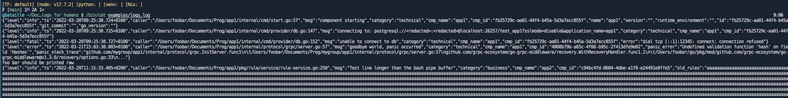
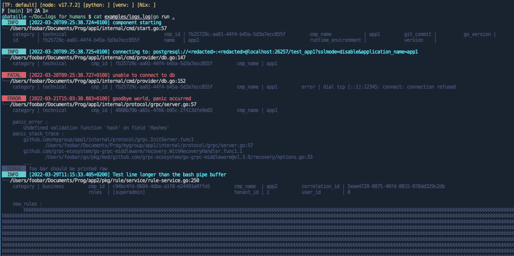

# Logs for Humans

Modern applications tend to log in a verbose manner and in a structured manner (JSON) for ingestion
in log browsing tools like the ELK stack.

This is all well and good, but there are 2 use cases where it's not practical
1. When developing the application. You want to be able to run it locally and, as a human, read the
   logs.
1. When you receive a log file (from a client for example) and have to make sense out of it.

A JSON log is not easy to parse, especially when it starts to get verbose

# Why another tool?

There are a few low tech solutions to think about before adding yet another tool to your setup:

## Configure the logger

Your application logger can certainly be configured to log as text rather than JSON. But then
- either you print only the log `msg` field and miss all the metadata, hoping that the `msg` field
  is enough and contain everything needed
- or you log all the fields, just not in JSON, which improves the situation but not by much
- and it does not help pinpoint the important information out of verbose logs
- and it does nothing for log files that you might want to read post facts.

## Use grep

This really only works on pre-existing log files and not on logs being printed live. Plus you have
to know what you are looking for and search something simple or be a master at regex which is
cumbersome

## Use jq

That was actually my first attempt, with expressions that would extract the important parts like the
timestamp, the level and the message. But realizing the message was not enough, I tried to get also
all the rest. I ended up with such an expression
```shell
jq -R -r ". as \$line | try (fromjson | \"[\" + .ts + \"][\" + (.level | ascii_upcase) + \"] \" + (if has(\"error\") then (.error + \" - \") else \"\" end)  + .msg + \" \" + (.block_number? | tostring) + \" (\" + .caller + \")\" + \"\\n\\t\" + (\$line|fromjson|del(.msg)|del(.ts)|del(.caller)|del(.level)|del(.block_number)|tostring)) catch \$line"
```

This is hard to maintain and this actually did not do the work I wanted (i.e. it still was not readable
enough for me)

# Design requirements

So I wanted a tool that would
- **Process STDIN:** This would allow to both stream running application logs through it with a
  shell pipeline, or dump an existing log file into it with `cat` and a pipeline.
- **Highlight log level:** to spot instantly the most important things (ERROR) and tune down the
  lesser lines (DEBUG)
- **Highlight the main information:** make sure that the log message is not lost in the middle of
  all the log details
- **Align log lines:** logs typically all have a level, a timestamp and a message. Be sure those are
  aligned to increase log readability
- **Be rugged:** since it's meant to be used in a shell pipeline, it should not crash on unexpected
  input and be able to handle anything going through it.

# Solution

The solution relies heavily on the excellent [pterm](github.com/pterm/pterm) library.
- Each log level uses a different color
- Log level and timestamp start the line
- Log message follows and uses the same color which makes it pop-out with respect to the rest
- Then comes the log "sender" (typically the file location sending the log line) in a whithish color
- And finally all the other log fields, in a "backgroundish" color so that they are less prominent.

**BEFORE**


**AFTER**



# Installation

```bash
go install github.com/gbataille/logs_for_humans@latest
```

# Usage

```bash
./my_application | logs_for_humans
```

or

```bash
cat ./my_log_file | logs_for_humans | less
```

# Limitations

This tool is very much a work in progress, so a lot of things are a bit raw.

In particular, it's at the moment not configurable, meaning it only properly recognized logs that
have
- a `level` key, with values in `"error", "fatal", "warn", "warning", "info", "debug"` (case
  insensitive)
- a `ts` key with a unix timestamp in seconds
- a `msg` key with the main log message
- preferably a `caller` key with the message source
